<h1> Etape 1 Microservice : Customer-Service</h1>

  Le microservice <strong>customer-service</strong> permet de gérer les clients dans une architecture microservices.
  Il expose des endpoints REST via <strong>Spring Data REST</strong>, utilise une base de données 
  <strong>H2</strong> et charge des clients par défaut au démarrage.

 

<h2> 1. Package <code>entities</code></h2>

Ce package contient les classes métier. L’entité principale est <strong>Customer</strong>.

<h3>✔ Customer.java</h3>

<pre>
@Entity
@Data @AllArgsConstructor @NoArgsConstructor
public class Customer {
    @Id @GeneratedValue(strategy = GenerationType.IDENTITY)
    private Long id;
    private String name;
    private String email;
}
</pre>

   Représente un client dans la base de données. 
   Lombok génère automatiquement getters, setters et constructeurs.

<h2> 2. Package <code>repositories</code></h2>

  Ce package contient l’interface JPA qui permet d’accéder aux données.
  Spring Data REST expose automatiquement les endpoints REST.

Endpoints exposés automatiquement :

<ul>
  <li><code>GET /api/customers</code></li>
  <li><code>GET /api/customers/{id}</code></li>
  <li><code>POST /api/customers</code></li>
  <li><code>DELETE /api/customers/{id}</code></li>
</ul>

<h2> 3. Package <code>config</code></h2>

  Par défaut, Spring Data REST masque les IDs dans le JSON.  
  Ce package contient la configuration qui permet de <strong>rendre les IDs visibles</strong>.

<h3> RepositoryConfig.java</h3>

 Cela permet d'afficher les identifiants dans les réponses JSON :

<pre>
{
  "id": 1,
  "name": "Mohamed",
  "email": "med@gmail.com"
}
</pre>

<h2> Test de l’API</h2>

Une fois le microservice lancé :

<ul>
  <li><strong>URL principale :</strong> <code>http://localhost:8081/api/customers</code></li>
  <li>Affiche la liste complète des clients avec leurs IDs visibles.</li>
</ul>

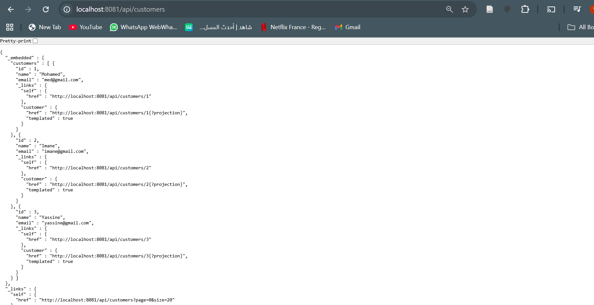

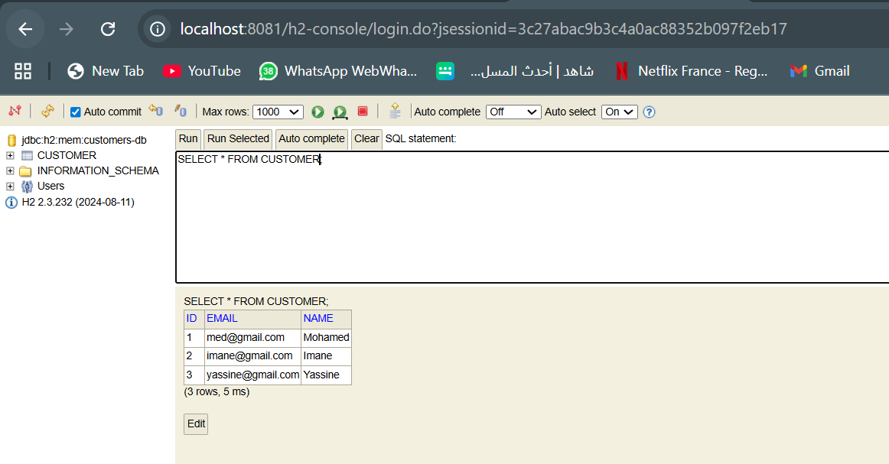

<h1> Etape 2 Microservice : Inventory-Service</h1>

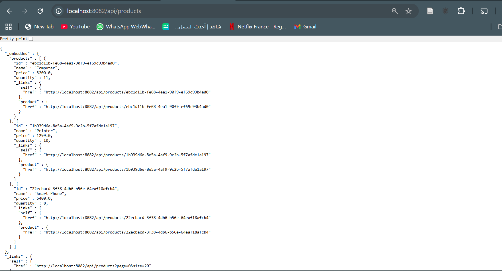

H2 database products-db 
 

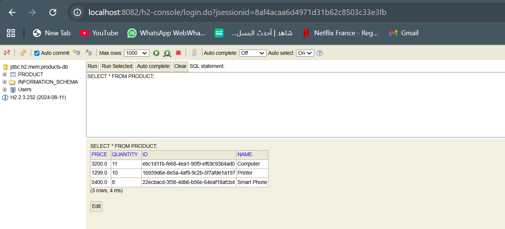

L'etat du service avec (health) 

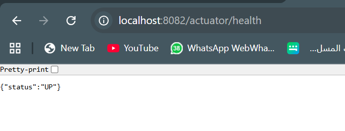

Tous les ends points que generent Actuator 

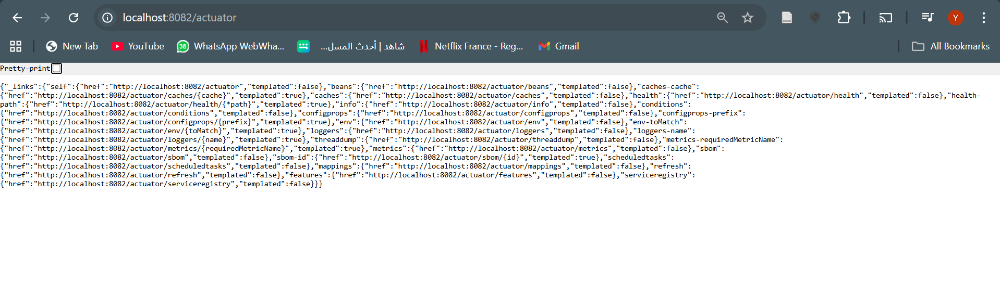

<h2> Test de l’API</h2>

Une fois le microservice lancé :

<ul>
  <li><strong>URL principale :</strong> <code>http://localhost:8082/api/products</code></li>
  <li>Affiche tous les produits disponibles.</li>
</ul>

Exemple d'appel avec <strong>curl</strong> :

<pre>
curl http://localhost:8082/api/products
</pre>

<h1> Etape 3 Microservice : Gateway-Service</h1>

  Le microservice <strong>gateway-service</strong> joue le rôle de point d’entrée unique dans l’architecture microservices.
  Il utilise <strong>Spring Cloud Gateway MVC</strong> pour router les requêtes et <strong>Eureka Discovery</strong> pour
  détecter automatiquement les microservices actifs.

<ul>
  <li>Centralisation des appels API</li>
  <li>Redirection vers les microservices internes</li>
  <li>Simplification de l’accès pour le frontend</li>
  <li>Possibilité d'ajouter sécurité, CORS, authentification</li>
</ul>

<h2>1. Configuration <code>application.yml</code></h2>

La Gateway écoute sur le port <strong>8888</strong> et redirige les requêtes selon leur chemin.

<pre>
server:
  port: 8888

spring:
  application:
    name: gateway-service

  cloud:
    gateway:
      mvc:
        routes:
          - id: customer-service
            uri: http://localhost:8081
            predicates:
              - Path=/api/customers/**

          - id: inventory-service
            uri: http://localhost:8082
            predicates:
              - Path=/api/products/**
</pre>

  Chaque route correspond à un microservice interne.  
  La Gateway fait le lien entre les URL externes et les APIs internes.

<h2>2. Fonctionnement de l’API Gateway</h2>

  Grâce à la Gateway, le frontend ou les clients externes n'ont plus besoin de connaître les ports internes.
  Ils accèdent à tous les services via un seul point : <strong>http://localhost:8888</strong>

<ul>
  <li><code>http://localhost:8888/api/products</code> → Inventory-Service (8082)</li>
  <li><code>http://localhost:8888/api/customers</code> → Customer-Service (8081)</li>
</ul>

  Cela rend l'architecture plus flexible, plus sécurisée et beaucoup plus simple à consommer.

<h2>3. Avantages de l'API Gateway</h2>

<ul>
  <li><strong>Point d’entrée unique</strong> pour tout le système</li>
  <li><strong>Découplage</strong> entre frontend et microservices</li>
  <li><strong>Routage intelligent</strong> (basé sur les paths)</li>
  <li><strong>Support d’Eureka</strong> pour détecter les services</li>
  <li><strong>Extensible</strong> (sécurité, rate limiting, monitoring…)</li>
</ul>

<h2>4. Test de la Gateway</h2>

Une fois la Gateway lancée :

<ul>
  <li><strong>Produits via Gateway :</strong> <code>http://localhost:8888/api/products</code></li>
  <li><strong>Clients via Gateway :</strong> <code>http://localhost:8888/api/customers</code></li>
</ul>

La Gateway se charge automatiquement du routage vers les microservices internes.

<h2>Aperçu des résultats via Gateway</h2>

<strong>1. Liste des produits via Gateway :</strong>

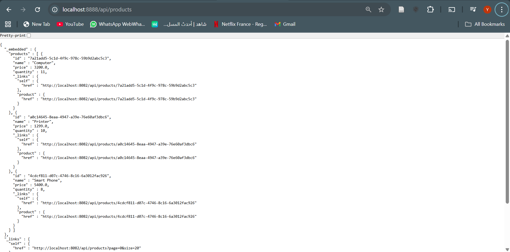

<strong>2. Liste des clients via Gateway :</strong>

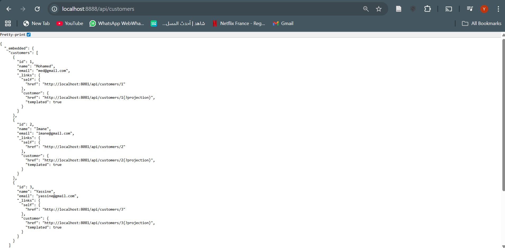

<h1> Étape 4 — Discovery-Service (Eureka Server)</h1>

Le microservice <strong>discovery-service</strong> joue le rôle de 
<strong>registre de services</strong> (Service Registry).  
Il permet :

<ul>
  <li>La <strong>découverte dynamique</strong> des microservices</li>
  <li>L'<strong>enregistrement automatique</strong> de Customer-Service, Inventory-Service et Gateway</li>
  <li>Le <strong>load balancing</strong> avec Eureka + Gateway</li>
  <li>Un dashboard web pour monitorer les services</li>
</ul>

<h2> 1. Configuration Eureka</h2>

<h3>application.properties</h3>

<pre>
spring.application.name=discovery-service
server.port=8761

eureka.client.fetch-registry=false
eureka.client.register-with-eureka=false
</pre>

<h2> 2. Classe principale</h2>

<pre>
@SpringBootApplication
@EnableEurekaServer
public class DiscoveryServiceApplication {
    public static void main(String[] args) {
        SpringApplication.run(DiscoveryServiceApplication.class, args);
    }
}
</pre>

<h2> 3. Lancement d’Eureka</h2>

Une fois démarré :

<ul>
  <li>Dashboard disponible ici :  
      <strong>http://localhost:8761</strong>
  </li>
</ul>

<strong>1. Dashboard de Eureka avec les nos micro-services  :</strong>

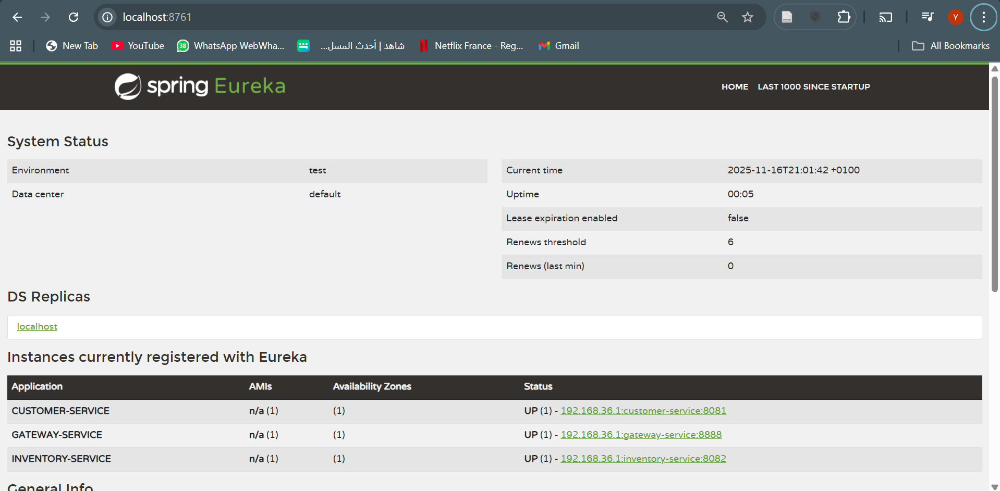

<strong>2. Liste des clients avec routage dynamique  :</strong>

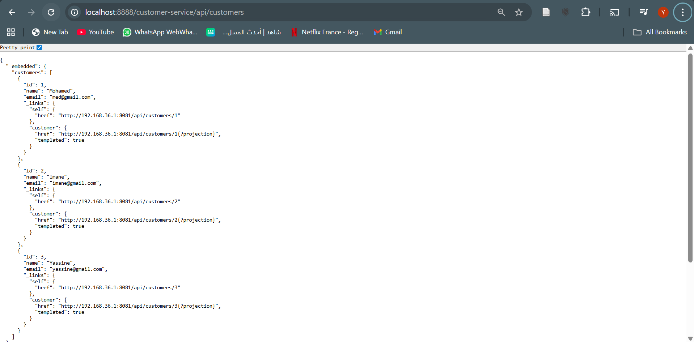

<strong>3. Liste des produits avec routage dynamique :</strong>

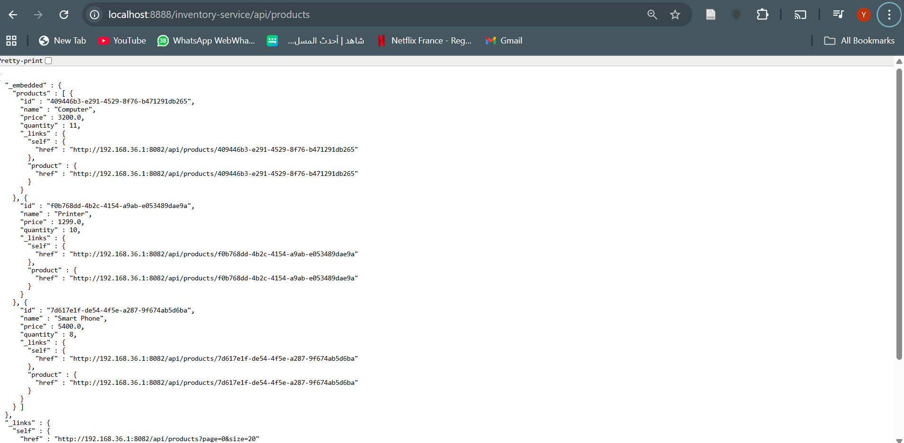

On constate que :

<ul>
  <li><strong>CUSTOMER-SERVICE</strong> est UP</li>
  <li><strong>INVENTORY-SERVICE</strong> est UP</li>
  <li><strong>GATEWAY-SERVICE</strong> est UP</li>
</ul>

<h2> Architecture finale </h2>

<pre>
   Gateway-Service (8888)
          |
   -------------------------
   |                       |
Customer-Service      Inventory-Service
     8081                  8082
          \               /
            Eureka Server (8761)
</pre>

<h2>  Projet Microservices Fonctionnel </h2>

Tous les services communiquent correctement via Eureka et la Gateway.  
Les endpoints sont accessibles de manière centralisée sur :

<ul>
  <li><strong>http://localhost:8888/customer-service/api/customers</strong></li>
  <li><strong>http://localhost:8888/product-service/api/products</strong></li>
</ul>

<strong>Architecture totalement opérationnelle </strong>

