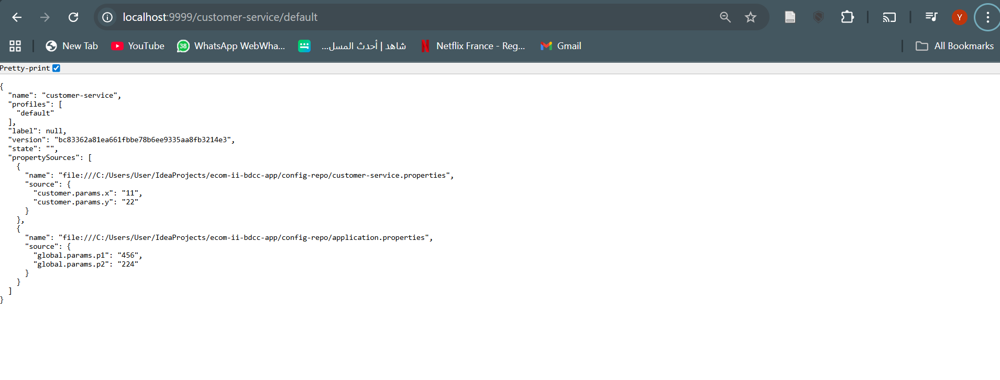
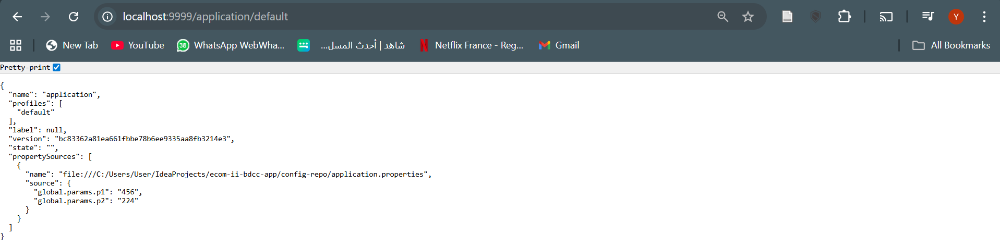
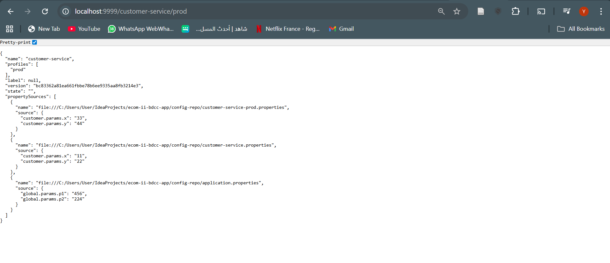
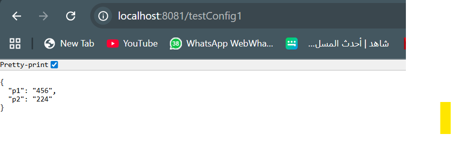
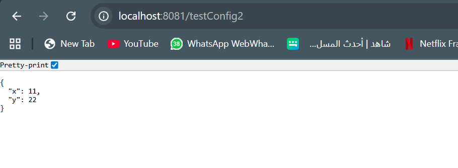
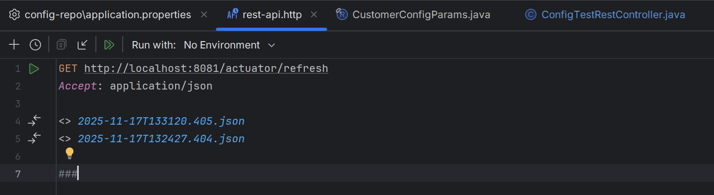
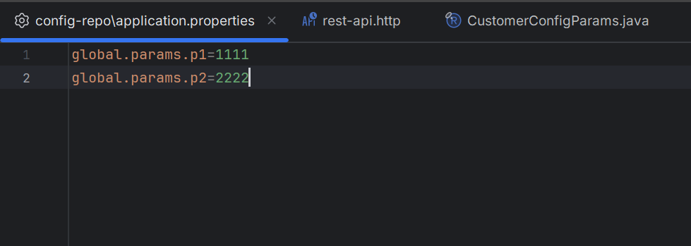
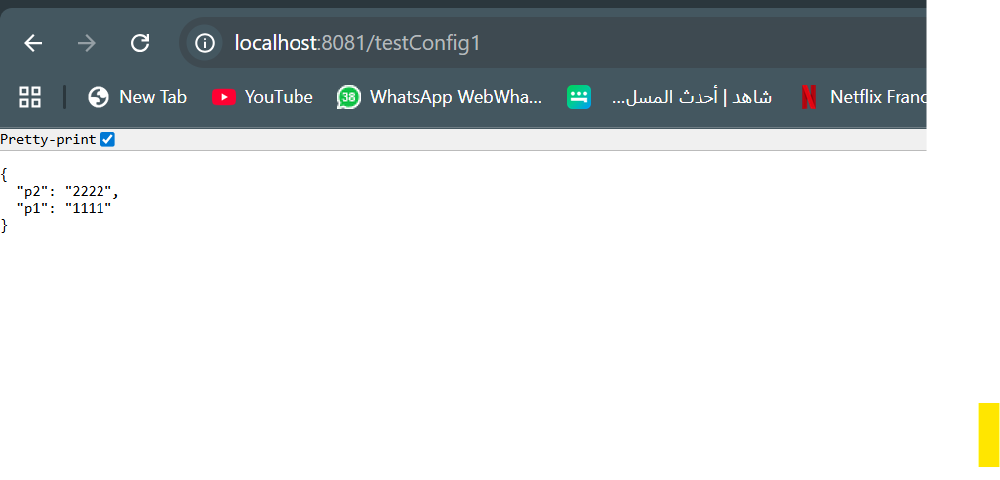
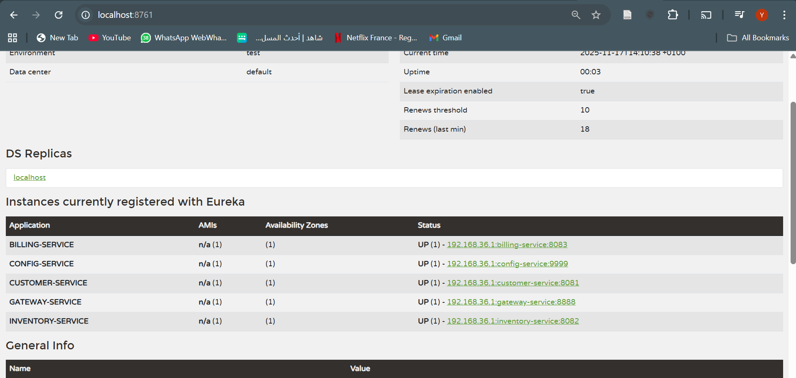
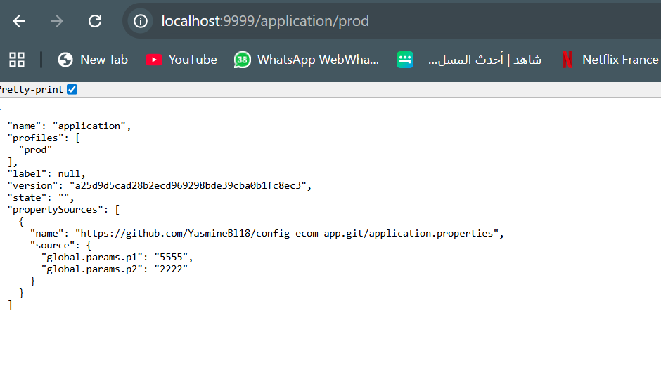

<h1> Étape 1 — Microservice : Customer-Service</h1>

  Le microservice <strong>customer-service</strong> gère les clients dans l’architecture microservices.
  Il expose des endpoints REST via <strong>Spring Data REST</strong>, utilise une base <strong>H2</strong> 
  et charge des clients par défaut au démarrage.

<h2>1. Package <code>entities</code></h2>

L’entité principale est <strong>Customer</strong>.

<h3>✔ Customer.java</h3>

<pre>
@Entity
@Data @AllArgsConstructor @NoArgsConstructor
public class Customer {
    @Id @GeneratedValue(strategy = GenerationType.IDENTITY)
    private Long id;
    private String name;
    private String email;
}
</pre>

Lombok génère automatiquement getters, setters et constructeurs.

<h2>2. Package <code>repositories</code></h2>

  Contient l’interface JPA pour accéder aux données.
  Spring Data REST expose automatiquement plusieurs endpoints :

<ul>
  <li><code>GET /api/customers</code></li>
  <li><code>GET /api/customers/{id}</code></li>
  <li><code>POST /api/customers</code></li>
  <li><code>DELETE /api/customers/{id}</code></li>
</ul>

<h2>3. Package <code>config</code></h2>

  Ce package contient la configuration permettant de <strong>rendre les IDs visibles</strong> dans les réponses JSON.

<h3>Exemple :</h3>

<pre>
{
  "id": 1,
  "name": "Mohamed",
  "email": "med@gmail.com"
}
</pre>

<h2> Test de l’API</h2>

<ul>
  <li><strong>URL :</strong> <code>http://localhost:8081/api/customers</code></li>
  <li>Affiche la liste des clients avec IDs visibles.</li>
</ul>

<h1> Étape 2 — Microservice : Inventory-Service</h1>

Base H2 : <strong>products-db</strong>
 

<h2>Test de l’API</h2>

<ul>
  <li><code>GET http://localhost:8082/api/products</code></li>
</ul>

<pre>
curl http://localhost:8082/api/products
</pre>

<h1> Étape 3 — Microservice : Gateway-Service</h1>

  Le <strong>gateway-service</strong> est le point d’entrée unique.  
  Il utilise <strong>Spring Cloud Gateway MVC</strong> et <strong>Eureka Discovery</strong>.

<ul>
  <li>Centralisation des requêtes</li>
  <li>Routage vers les microservices internes</li>
  <li>Simplification de l’accès pour le frontend</li>
  <li>Possibilité d’ajouter sécurité, CORS, authentification…</li>
</ul>

<h2>Configuration <code>application.yml</code></h2>

<pre>
server:
  port: 8888

spring:
  application:
    name: gateway-service

  cloud:
    gateway:
      mvc:
        routes:
          - id: customer-service
            uri: http://localhost:8081
            predicates:
              - Path=/api/customers/**

          - id: inventory-service
            uri: http://localhost:8082
            predicates:
              - Path=/api/products/**
</pre>

<h2> Test de la Gateway</h2>

<ul>
  <li><code>http://localhost:8888/api/products</code> → Inventory-Service</li>
  <li><code>http://localhost:8888/api/customers</code> → Customer-Service</li>
</ul>

<h1> Étape 4 — Discovery-Service (Eureka Server)</h1>

  Le <strong>discovery-service</strong> est le registre Eureka.  
  Il assure la découverte dynamique et l’enregistrement automatique des microservices.

<h2> Configuration</h2>

<pre>
spring.application.name=discovery-service
server.port=8761

eureka.client.fetch-registry=false
eureka.client.register-with-eureka=false
</pre>

Dashboard : <strong>http://localhost:8761</strong>

<h2> Architecture finale </h2>

<pre>
   Gateway-Service (8888)
          |
   -------------------------
   |                       |
Customer-Service      Inventory-Service
     8081                  8082
          \               /
            Eureka Server (8761)
</pre>

<h1> Étape 5 — Microservice : Billing-Service</h1>

  Le <strong>billing-service</strong> gère les factures.  
  Il communique avec Customer-Service et Inventory-Service via <strong>OpenFeign</strong>,  
  et stocke les données dans <strong>H2</strong>.

<h2>1. Entities</h2>

<h3>Bill.java</h3>

<pre>
@Entity
@Data @NoArgsConstructor @AllArgsConstructor @Builder
public class Bill {
    @Id @GeneratedValue(strategy = GenerationType.IDENTITY)
    private Long id;
    private Long customerID;
    private Date billingDate;
    @OneToMany(mappedBy = "bill")
    private List<ProductItem> productItems;
    @Transient private Customer customer;
}
</pre>

<h3>ProductItem.java</h3>

<pre>
@Entity
@Data @NoArgsConstructor @AllArgsConstructor @Builder
public class ProductItem {
    @Id @GeneratedValue(strategy = GenerationType.IDENTITY)
    private Long id;
    private Long productID;
    private int quantity;
    private double price;
    @ManyToOne private Bill bill;
    @Transient private Product product;
}
</pre>

<h2>2. Feign Clients</h2>

<pre>
@FeignClient(name="CUSTOMER-SERVICE")
interface CustomerRestClient {
    @GetMapping("/api/customers/{id}")
    Customer findCustomerById(@PathVariable Long id);
}
</pre>

<pre>
@FeignClient(name="INVENTORY-SERVICE")
interface InventoryRestClient {
    @GetMapping("/api/products/{id}")
    Product findProductById(@PathVariable String id);
}
</pre>

<h2>3. Initialisation</h2>

<pre>
@Bean
CommandLineRunner start(...) {
    return args -> {
        Customer c = customerClient.findCustomerById(1L);
        Bill bill = billRepository.save(new Bill(null, c.getId(), new Date(), null, null));

        Product p = inventoryClient.findProductById("id1");
        productItemRepository.save(
            ProductItem.builder().productID(p.getId()).price(p.getPrice()).quantity(3).bill(bill).build()
        );
    };
}
</pre>

<h2>4. Test de l’API</h2>

<ul>
  <li><code>GET http://localhost:8083/bills</code></li>
  <li><code>GET http://localhost:8083/bills/{id}</code></li>
</ul>

La réponse est enrichie avec les données Clients et Produits.

<h2>5. Via Gateway</h2>

<ul>
  <li><code>http://localhost:8888/billing-service/bills</code></li>
</ul>

<h1> Étape 6 — Microservice : config-service</h1>

  Le <strong>config-service</strong> centralise la configuration.  
  Nous avons testé les environnements <strong>dev</strong>, <strong>default</strong> et <strong>prod</strong>.

<h3> Test avec Customer-Service </h3>

Nous avons activé Spring Cloud Config et ajouté l’endpoint <code>/testConfig1</code> pour afficher les paramètres <strong>p1</strong> et <strong>p2</strong>.

<h3> Refresh dynamique (hot reload)</h3>

Grâce à l’endpoint <code>/actuator/refresh</code>, la configuration est rechargée à chaud :  
dès qu’un paramètre est modifié dans le dépôt Git, un POST sur <code>/refresh</code> met à jour automatiquement le Customer-Service sans redémarrage.

<h3> Optimisation de la config : On gere tous dans le fichier </h3>

